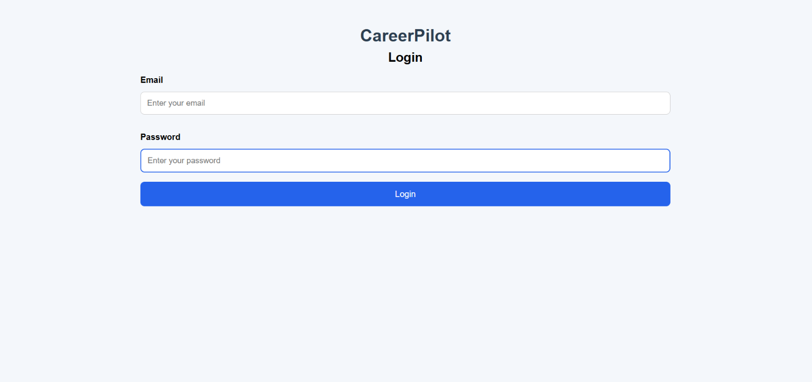
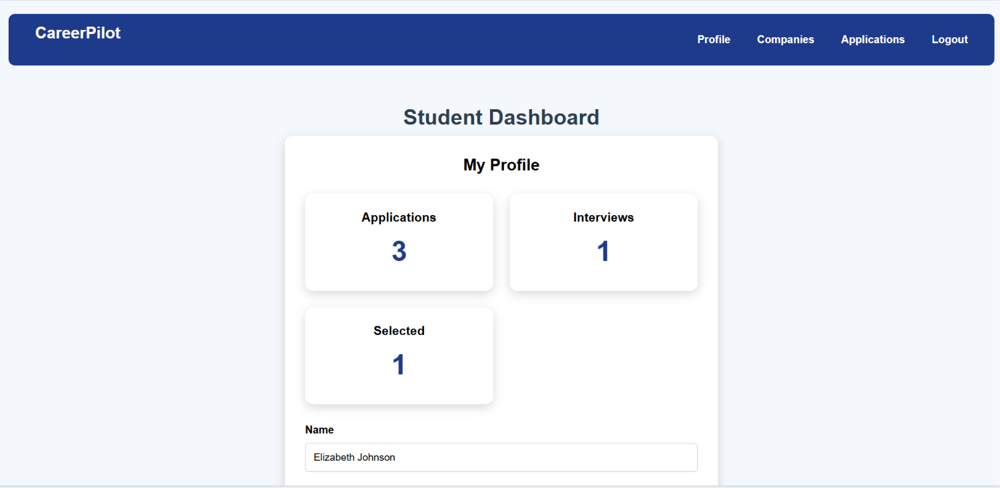
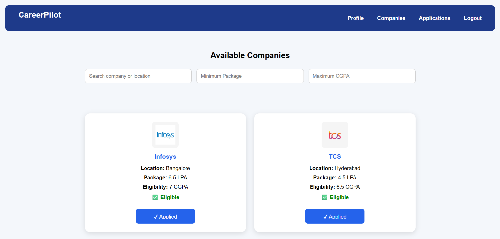
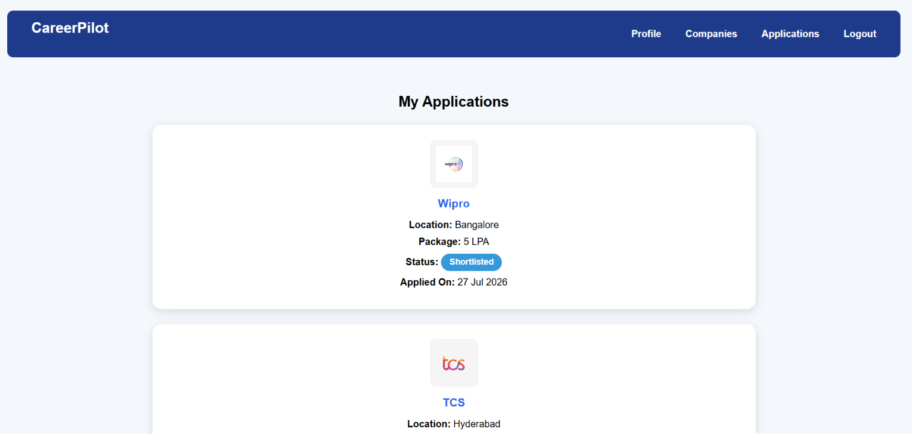
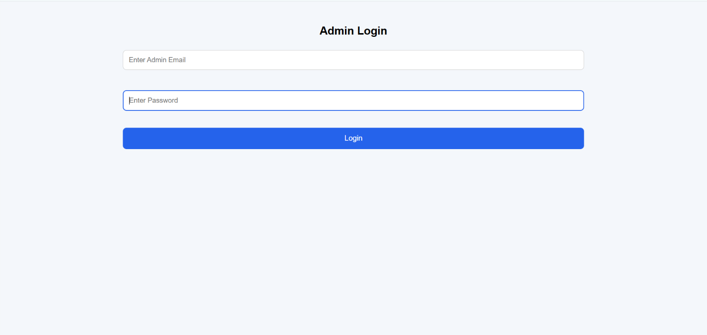
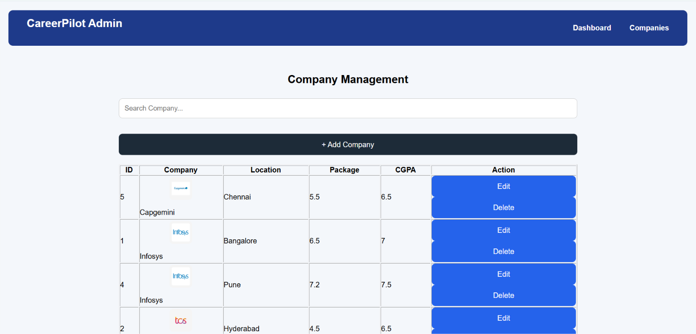
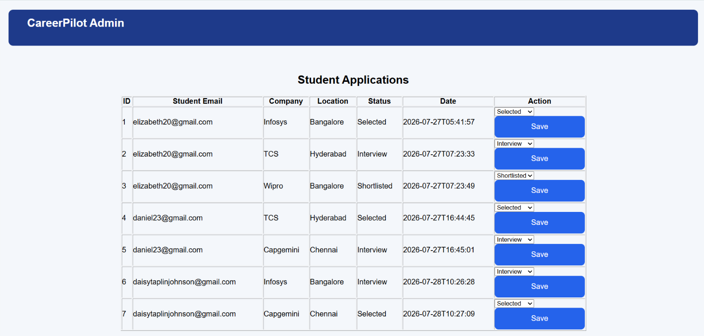

# CareerPilot - Placement Management System

CareerPilot is a full-stack placement management platform designed to simplify and organize the campus recruitment process.

The system provides a centralized platform where students can create and manage their profiles, explore company opportunities, apply for placements, and track their application progress. Administrators can manage company information and monitor student applications through an admin panel.

This project demonstrates practical full-stack development skills by combining frontend development, backend API design, database management, and cloud deployment.

## Project Overview

Campus placement processes often involve managing large amounts of student, company, and application data. CareerPilot aims to make this process more efficient by providing a structured digital solution.

The application connects students and placement administrators through a single platform, reducing manual tracking and improving accessibility of placement information.

## Key Features

### Student Module

- Student registration and authentication
- Profile creation and management
- View available company opportunities
- Search and explore company details
- Apply for placement opportunities
- Track application status

### Company Management

- Store company details
- Manage eligibility criteria
- Maintain package and location information
- Provide organized company listings

### Admin Module

- Secure administrator login
- Add, update, and manage companies
- View student applications
- Update application status
- Monitor placement activities

## Technology Stack

### Frontend
- HTML5
- CSS3
- JavaScript

### Backend
- Python
- FastAPI
- REST API

### Database
- MySQL

### Development Tools
- Visual Studio Code
- Git
- GitHub

### Deployment
- Railway (Backend)
- Netlify (Frontend)

## Application Architecture

Frontend (HTML, CSS, JavaScript)

        |

        |

FastAPI Backend (REST APIs)

        |

        |

MySQL Database

## Live Application

Frontend:
https://careerpilot-app.netlify.app

Backend:
https://careerpilot-production-77eb.up.railway.app

## Project Screenshots

### Student Login

### Student Dashboard

### Company Opportunities

### Application Tracking

### Admin Login

### Admin Company Management

### Admin Application Management

## Running the Project Locally

### Backend Setup

Install required dependencies:

pip install -r requirements.txt

Start the FastAPI server:

uvicorn main:app --reload

### Frontend Setup

Open the frontend folder in Visual Studio Code and run the application using Live Server.

## Future Enhancements

- AI-based resume analysis
- Job recommendation system
- Email notifications for application updates
- Advanced search and filtering
- Improved authentication and security features

## Developer

Elizabeth Johnson

BCA Student 

GitHub:
https://github.com/elizeejohnson20-sys